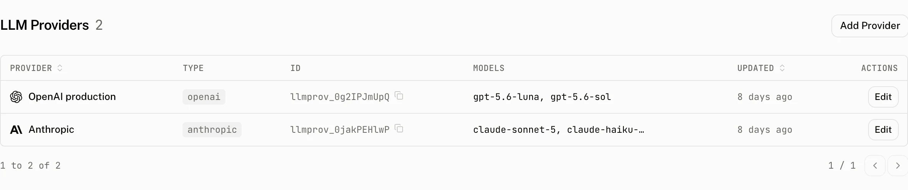

An LLM provider is a named connection to a model account. It holds the credentials and model catalog that Assistant Cloud needs when a feature calls a model, while keeping the credential values out of the dashboard.

A provider can supply a model for [thread titles](/docs/cloud/thread-titles), [Intelligence](/docs/cloud/intelligence), [Evaluators](/docs/cloud/evaluators), [Assistants](/docs/cloud/assistants), or a harness voice configuration. Each feature records the provider and model it uses, so its runs can be attributed to that model account.

## How providers are used

| Feature | How it uses a provider |
|---|---|
| [Thread titles](/docs/cloud/thread-titles) | Uses the selected provider and model to name conversations. When no title model is saved, the first model in the provider's stored list is selected. |
| [Intelligence](/docs/cloud/intelligence) | Uses the provider and model chosen in **Settings › Intelligence** to classify conversations. |
| [Evaluators](/docs/cloud/evaluators) | A rule can name a provider and model for its verdicts. |
| [Assistants](/docs/cloud/assistants) | Each assistant is bound to a provider and its model configuration. |
| Harness voice | A harness can hold a voice provider reference. |

## Configure a provider

Choose a preset when it matches your model account. The form renders one credential input for each field in that preset. Fields whose names contain `KEY`, `TOKEN`, or `SECRET` are password inputs.

| Preset | Stored type | Credential fields | Base URL rule |
|---|---|---|---|
| OpenAI | `openai` | `OPENAI_API_KEY` | No base URL field. |
| Anthropic | `anthropic` | `ANTHROPIC_API_KEY` | No base URL field. |
| Google AI | `google` | `GOOGLE_GENERATIVE_AI_API_KEY` | No base URL field. |
| xAI | `xai` | `XAI_API_KEY` | No base URL field. |
| Mistral AI | `mistral` | `MISTRAL_API_KEY` | No base URL field. |
| Groq | `groq` | `GROQ_API_KEY` | No base URL field. |
| Azure AI Foundry | `azure` | `AZURE_RESOURCE_NAME`, `AZURE_API_KEY` | The deployment host is derived from the resource name. |
| Amazon Bedrock | `amazon-bedrock` | `AWS_ACCESS_KEY_ID`, `AWS_SECRET_ACCESS_KEY`, `AWS_REGION` | No base URL field. |
| DeepSeek, Hugging Face, Fireworks AI, Together AI, OpenRouter, NVIDIA, Perplexity, Cerebras, SiliconFlow, Ollama Cloud, Cloudflare AI Gateway, or Cloudflare Workers AI | `openai-compatible` | The preset's fields, such as `DEEPSEEK_API_KEY`, `OPENROUTER_API_KEY`, or the Cloudflare token, account, and gateway fields. | Uses that preset's URL template. A template that reads credentials hides the URL input and derives the URL from those values. |
| Custom OpenAI Compatible | `openai-compatible` | Optional `API_KEY` | A base URL is required. |

### Form rules

| Rule | Effect |
|---|---|
| Name | Required, from 1 to 255 characters. The form shows `Name is required` when it is empty. A project cannot have two providers with the same name. |
| Base URL | It must be a valid public HTTPS URL. OpenAI compatible providers require one and the form shows `Base URL is required for OpenAI Compatible providers` when it is missing. |
| Primary secret on create | A provider type that declares a primary secret requires that field when you create it. The custom OpenAI compatible form keeps `API_KEY` optional. |
| Credentials on update | Leave a credential empty to keep its current value. The dashboard does not return stored credential values. |
| Type or base URL changes | Send new credentials in the same save. Otherwise the save is refused with `Changing provider type or base URL requires new credentials in the same request`. A routing change replaces the credential map. Other credential updates merge with it. |
| Available models | The comma separated `Available models` field appears only for OpenAI compatible providers. Those are the models this provider declares by hand. |

The URL check rejects private hosts. It applies when the provider is created and when its base URL changes, before the cloud stores the connection.

## How model discovery works

The dashboard asks the provider for models, then shows the live result when possible. Every outbound request is checked as a public URL, has a five second timeout, and returns `null` rather than an error if the provider call fails.

| Provider type | Model listing request |
|---|---|
| OpenAI | `{base URL or https://api.openai.com/v1}/models` with bearer authentication. |
| Anthropic | `/models?limit=1000` with `anthropic-version: 2023-06-01` and `x-api-key`. |
| Google AI | `/models?pageSize=1000` with `x-goog-api-key`. Only models that support `generateContent` remain, and the `models/` prefix is removed. |
| xAI, Mistral AI, Groq | Each provider's `/models` endpoint. |
| Azure AI Foundry | `https://{AZURE_RESOURCE_NAME}.openai.azure.com/openai/deployments?api-version=2023-03-15-preview` with `api-key`. Azure lists deployments rather than models. |
| Amazon Bedrock | `https://bedrock.{AWS_REGION}.amazonaws.com/foundation-models`, signed with AWS credentials. The list keeps only models with `TEXT` output and `ON_DEMAND` inference. When no region is supplied, it uses `us-east-1`. |
| OpenAI compatible | `{base URL or preset URL}/models`. |

The cloud caches a provider's live result for five minutes. The cache is keyed by provider and invalidated when that provider changes. If the live list is unavailable, it falls back to the catalog for the provider key, then to an empty list. Stored compatible-provider models are unioned into the result and the response reports `source: "provider"` or `source: "catalog"` so the dashboard can say where the list came from.

## Credential storage and audit history

Credential values are encrypted with AES-256-GCM. Each value has a new 12 byte random IV and is stored as `enc:<iv_hex>:<ciphertext_hex>`; credential names remain in clear text so the cloud can render the needed inputs.

Provider creation, updates, and deletion enter the audit log as `provider.create`, `provider.update`, and `provider.delete`. The audit record includes the name, type, provider key, model list, and credential map. Audit redaction removes credential key names that match `api_key`, `credentials`, `secret`, `sha256`, or `suffix`, and a configured base URL is recorded as `[redacted]`.

## Costs and limits

The provider key is the catalog identity that the cloud uses for model discovery and pricing. Set it to the preset's catalog key when you need catalog pricing and a catalog fallback. A compatible provider's hand declared models remain available even when the live list is unavailable.

You cannot delete a provider while an assistant still uses it. The dashboard refuses the delete with `This provider is currently in use by one or more assistants. Please update or delete the assistants using this provider first.` Update or remove those assistants before deleting the provider.

## Troubleshooting

| What you see | Why | What to do |
|---|---|---|
| The model list is empty | The live listing failed, and the provider key has no catalog fallback or the compatible provider has no declared models. | Check the credentials and provider URL, then add comma separated models for a compatible provider when it cannot list models itself. |
| `The provider does not list that model` when saving Thread titles | The selected title model is not in the chosen provider's stored model list. | Choose a listed model or update the provider's model list. |
| A private URL is refused | Provider URLs must be public HTTPS URLs. | Use a public HTTPS endpoint for the provider. |
| Thread title runs report provider errors | The title feature uses the provider credentials and selected model for its model call. | Verify the provider credentials, the model list, and the model account's access to that model. |
