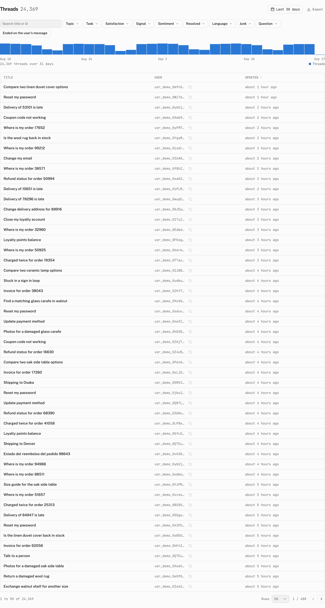

LangGraph, LangChain and Google ADK keep the conversation on your backend. Passing `cloud` gives those runtimes a Cloud backed thread list, a copy of each conversation, feedback and engagement events, while the backend continues to own the messages and model execution.

The cloud creates, lists, renames, archives and deletes the conversation records users see in the app, and keeps a copy of their messages for the dashboard. It does not receive browser run reports from these runtimes, so use traces when you want the Runs and Models views to describe your backend.

## What the cloud adds



| Surface | What happens |
|---|---|
| Thread list | The cloud stores the thread title, archive state, custom data, last message time and your backend id as `external_id`. |
| Messages | When a run settles, the runtime stores a copy of the new and changed messages as `aui/v0`, keyed by your backend's message ids, so the dashboard shows the transcript. Earlier messages of a conversation are copied the first time it continues after the upgrade. The runtime never reads the copy back; your backend stays the source. |
| Tool interactions | What a user does in a tool UI (`unstable_recordInteraction`) is kept on that tool call in the copy, never sent to your backend; the runtime's own message does not carry it. With the copy turned off, `unstable_recordInteraction` rejects, as it does without Cloud. |
| Feedback | Ratings are stored against the copied messages. |
| Engagement | Composer, message, tool and thread interactions are recorded as engagement events. |
| Attachments | The runtime keeps the attachment adapter you pass in `adapters`; the Cloud attachment adapter is not installed for it. |
| Run reports | Not sent by these runtimes. Runs and Models come from [traces](#fill-runs-and-models-with-traces). |

The copy is observability data. `telemetry: { messages: false }` on the `AssistantCloud` client keeps it out while the thread list, events and titles continue; `telemetry: false` also stops events. A stored user message counts its end user toward the project's monthly active users.

## Connect your backend

`useLangGraphRuntime` accepts `cloud` with three callbacks. `create` creates the backend conversation and returns its id as `externalId`. The cloud writes that value as `external_id`. `load` receives the same value when a user opens the cloud thread. `delete` runs before the cloud thread is deleted and receives the cloud thread id, so read the thread to find your backend id.

```tsx title="app/chat/runtime-provider.tsx"
const runtime = useLangGraphRuntime({
  cloud,
  stream: async (messages, { initialize }) => {
    const { externalId } = await initialize();
    if (!externalId) throw new Error("Thread not found");
    return sendMessage({ threadId: externalId, messages });
  },
  create: async () => ({ externalId: (await createThread()).thread_id }),
  load: async (externalId) => ({
    messages: (await getThreadState(externalId)).values.messages ?? [],
  }),
  delete: async (cloudThreadId) => {
    const { external_id } = await cloud.threads.get(cloudThreadId);
    if (external_id) await deleteThread(external_id);
  },
});
```

`useStreamRuntime` from `@assistant-ui/react-langchain` and `useAdkRuntime` from `@assistant-ui/react-google-adk` use the same Cloud thread-list arrangement. When `create` is omitted, the runtime initializes its own thread first and that initialization supplies the external id for the cloud thread. `onThreadIdChange` receives the settled cloud thread id on all three runtimes.

### Choose one thread-list owner

`useLangGraphRuntime` treats `unstable_threadListAdapter` as the thread-list owner. When it is present, `cloud`, `create` and `delete` do nothing. `useAdkRuntime` does the same with `sessionAdapter`: it takes precedence, so its `cloud`, `create` and `delete` options are inert. Keep the Cloud adapter when you want Cloud threads, or supply one of those adapters when your application already owns the list.

## Give the first thread a title

The runtime asks for a title as soon as it creates the cloud thread, with the user's message, and the cloud streams the title back as the model writes it. Nothing has to be stored in the cloud for that, so these runtimes are titled like every other one. `generateTitle()` on the thread list item asks again and receives the stored title. See [Thread titles](/docs/cloud/thread-titles) for the title rules and the fallback shown while a title is absent.

## Fill Runs and Models with traces

Export your server's GenAI OpenTelemetry spans to `POST /v1/traces`. A trace becomes a run with its spans, steps, tool calls, token counts and model information. Set `gen_ai.conversation.id` to the Cloud thread id so the run is attached to the conversation. If that value does not name a Cloud thread, it remains an attribute on the imported run instead.

Traces are accepted with an API key, not a browser token. They are the appropriate reporting path for LangGraph, LangChain and ADK because the work happens on the server. In a Next.js app that hosts the graph, the exporter is registered once at startup:

```ts title="instrumentation.ts"
import { registerOTel } from "@vercel/otel";
import {
  createAssistantCloudSpanProcessor,
  createAssistantCloudTraceExporter,
} from "assistant-cloud/telemetry";

export function register() {
  registerOTel({
    serviceName: "my-agent",
    spanProcessors: [
      "auto",
      createAssistantCloudSpanProcessor(
        createAssistantCloudTraceExporter({
          apiKey: process.env.ASSISTANT_API_KEY!,
        }),
      ),
    ],
  });
}
```

A Python graph exports the same way through the OpenTelemetry SDK's OTLP HTTP exporter, pointed at `https://backend.assistant-api.com/v1/traces` with the API key as the bearer header; [Traces](/docs/cloud/traces#configure-another-producer) has the configuration. [Run reports](/docs/cloud/run-reports) describes what the browser still reports on its own.

## Feedback needs remote ids

The feedback adapter submits a rating only after it can resolve both ids needed by the API. It never blocks the interface or throws into it.

| What is missing | Console warning | What to do |
|---|---|---|
| The cloud thread id | `[assistant-ui] Skipping feedback for message <id>: the thread has no remote id.` | Let the thread finish initialization before users can rate its messages. |
| The cloud message id | `[assistant-ui] Skipping feedback for message <id>: no cloud message id is mapped.` | The message has not been copied yet: it is still streaming, the copy failed, or `telemetry: { messages: false }` is set. The copy is written when the run settles. |

When both ids exist, the adapter sends `positive` or `negative` feedback for that message. See [Scores](/docs/cloud/scores) for how ratings appear in the project.

## Troubleshooting

| What you see | Why | What to do |
|---|---|---|
| A cloud thread has no backend conversation | `create` did not return the backend id, and the runtime had no initialized thread to use as a fallback. | Return `{ externalId }` from `create`, or initialize the runtime's own thread before the cloud thread is created. |
| The title stays at the app fallback | The title attempt failed and the hourly sweep has not retried it yet, or the list has not reloaded since the cloud wrote the title. | Open the thread in the dashboard and read the Title row of its Details rail, then reload the list. |
| The dashboard shows a thread but no transcript | Nothing has run in it since the upgrade, or `telemetry: { messages: false }` is set, or the copy failed (the console warns once with `[useExternalStoreRuntime] Failed to copy history.`). | Continue the conversation once, or check the telemetry setting and the warning. |
| One message is missing from the dashboard's transcript | The cloud refused its copy, for example because it is over the [message size limit](/docs/cloud/limits). The console names it with `[assistant-ui] The cloud refused the copy of message <id>`, and the messages after it are copied without it. | Keep payloads that large out of the message. A later change to the message copies it again. |
| A conversation stops being copied partway | The cloud refused the thread as a whole: it was deleted, its end user is past the plan's monthly active user cap, or it refused the thread's first two messages, as a self-hosted server older than v0.2.0 does. The console says `[assistant-ui] The cloud refused copies to thread <id>` once, and nothing more is sent for that thread until the page reloads. | Restore the thread or raise the cap, then reload. |
| Runs and Models are empty | The runtime does not send browser run reports. | Export server spans and set `gen_ai.conversation.id` to the Cloud thread id. |
| A feedback click logs a skip warning | The remote thread id or mapped message id is not available. | Follow the matching feedback row above. |
| Cloud options appear to have no effect | `unstable_threadListAdapter` or `sessionAdapter` owns the list. | Remove that adapter to use Cloud, or configure Cloud behavior in the adapter you supplied. |
