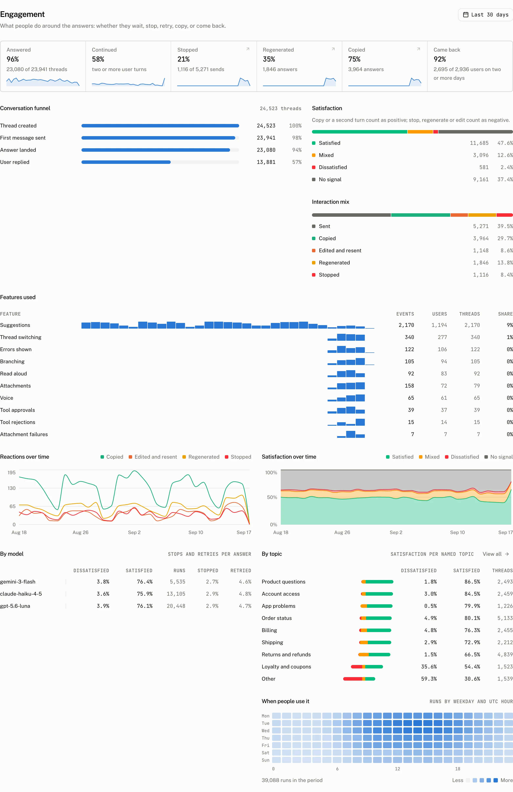

Engagement measures the actions people take around the assistant's answers. It turns events from the assistant-ui cloud client into conversation, reaction, adoption, and satisfaction readings without recording message text.

## What the page answers

The six tiles cover the selected range.

| Tile | What it counts |
| --- | --- |
| Answered | Threads that received an answer. |
| Continued | Threads with a second turn. |
| Stopped | Stops as a share of sends. |
| Regenerated | Regenerations as a share of sends. |
| Copied | Copies as a share of sends. |
| Came back | Users who returned on another day. |

### Conversation funnel

**Conversation funnel** shows the path from a thread through an answer and a continued conversation. It reads “No threads in this period” when the range has none.

### Satisfaction

Satisfaction is a rule over interactions, not a model judgement. The dashboard states: “Copy or a second turn count as positive; stop, regenerate or edit count as negative.” A thread is satisfied when it has a positive signal and no negative signal, mixed when it has both, dissatisfied when it has a negative signal and no positive signal, and no signal when it has neither.

The page shows this notice when the events client is missing: “Needs the events client. Stops, regenerates and edits come from the assistant-ui cloud client; without them only the positive half of the score exists.” The notice matters because copies and second turns still provide the positive signals, while stops, regenerations, and edits are client events.

### Interaction mix

**Interaction mix** charts these five event kinds over the range.

| Interaction | Event kind |
| --- | --- |
| Sent | `message_sent` |
| Edited and resent | `message_edited` |
| Regenerated | `message_regenerated` |
| Copied | `message_copied` |
| Stopped | `run_stopped` |

When none are recorded, the page says: “No interactions recorded yet. Update the assistant-ui cloud client; it reports stops, edits, regenerates and copies without any message content.”

## Features and reactions

**Features used** counts the following interactions. These events are emitted when a person takes the corresponding action through assistant-ui components or primitives.

| Feature | What it counts |
| --- | --- |
| Attachments | `attachment_added` events when an attachment is added to the composer. |
| Suggestions | `suggestion_clicked` events, with `suggestions_shown` reporting impressions. |
| Branching | `branch_switched` events when someone changes an edit or regeneration branch. |
| Tool approvals | `tool_approved` events when a tool approval is accepted. |
| Tool rejections | `tool_rejected` events when a tool approval is rejected. |
| Read aloud | `speech_started` events when someone plays a message aloud. |
| Voice | `voice_started` events when someone starts voice input. |
| Thread switching | `thread_switched` events when someone opens another cloud thread. |
| Errors shown | `error_shown` events when an error is shown for a run. |
| Attachment failures | `attachment_failed` events when an attachment upload fails. |

**Reactions over time** plots the actions people take around answers across the selected range. **Satisfaction over time** plots the satisfied, mixed, dissatisfied, and no signal reading across the same period. **By model** compares the satisfaction reading across the models that answered, and **By topic** compares it across the dashboard's topics.

### When people use it

**When people use it** is a weekday by hour heatmap. It shows when engagement events occur, so patterns can be read by day of week and hour rather than from one daily total.

Every Engagement figure can lead to the matching [Threads](/docs/cloud/dashboard/threads) view through its Signal facet. The facet includes Stopped, Regenerated, Copied, Edited and resent, Attached a file, Clicked a suggestion, Switched branch, Approved a tool, Rejected a tool, and Saw an error, so the aggregate can be traced back to conversations.

## Troubleshooting

| What you see | Why | What to do |
| --- | --- | --- |
| Every tile is empty | The selected range has no recorded thread or engagement event data. | Check the range, then send activity through an assistant-ui cloud client with events enabled. |
| Satisfaction has only the positive half | The events client is missing, so the dashboard cannot receive stops, regenerations, or edits. | Update the assistant-ui cloud client and keep engagement events enabled. |
| A feature row stays at zero | The corresponding user action has not emitted its event for the selected range. | Exercise the action through the assistant-ui components or primitives, then check the range again. |
