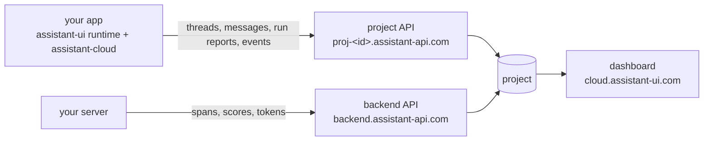

Assistant Cloud is the hosted backend for assistant-ui applications. Your app talks to it straight from the browser: threads and messages are stored as the conversation happens, every assistant run is reported with its timing, tokens, tools and outcome, and the user's interactions are recorded as engagement events. Your server can add the inside view by exporting its model and tool spans. The dashboard at [cloud.assistant-ui.com](https://cloud.assistant-ui.com) turns all of it into pages you can read: which conversations happened, how each run went, what each model costs, who your users are, and what they talk about.

## What you get

- **Threads and messages.** Conversations are persisted as they stream, resumed across sessions and devices, listed per user or workspace, titled automatically, archived and deleted. Messages are stored in the format your runtime uses and converted on read when another one asks.
- **Run reports.** Every assistant response is reported with its status and outcome, error, duration, time to first token, steps, tool calls, tokens, model and provider, and merged with your server's spans when you export them.
- **Engagement events.** Sixteen event kinds, from a send to a stop, a copy, a regenerate or a thread switch, recorded without message text.
- **Traces.** An OpenTelemetry receiver that joins your server's GenAI spans to the browser's report, so one run shows the client timing next to the model and tool call tree.
- **Scores and feedback.** Message ratings from your UI, custom scores from your own code, and model judged evaluators the cloud runs for you.
- **Attachments.** Uploads to project storage through presigned URLs, with signed reads for private buckets.
- **Intelligence.** Topics, tasks, unanswered questions, sentiment and resolution judged over your threads by a model of your choice.
- **Dashboard.** Overview, Threads, Runs, Models, Users, Engagement and Intelligence over any date range, with filters that are URL state, exports, alerts, an audit log, and a read only demo project.
- **Authentication and access.** Anonymous visitors, your own auth provider's tokens, or API keys from your server; allowed origins per project; plan limits counted in active users.

## How it fits together

Two hosts serve a project. The **frontend API URL**, `https://proj-<id>.assistant-api.com`, answers the browser with an anonymous session or a token from your auth provider, and only from the origins you allow. The **backend API**, `https://backend.assistant-api.com`, answers your server with an API key: minting user tokens, exporting traces, writing scores, reading the project's runs and usage. The `assistant-cloud` package is the client for both, and the assistant-ui runtimes drive it for you.

## Concepts

Everything a project stores hangs off a few objects. The dashboard, the API and the SDK use the same names.

| Object | What it is |
|---|---|
| **Project** | The unit of everything: its own API hosts, API keys, auth rules, allowed origins, retention, features and plan. The id is `proj_` and twelve characters, and the frontend host is the id with its underscore written as a hyphen: `proj_abc…` is served at `https://proj-abc….assistant-api.com`. |
| **Workspace and user** | Every request runs as a user inside a workspace, and a workspace owns threads: a thread is only ever visible from its own workspace. A provider token carries both; an API key names them in headers. Personal chats use the user id as the workspace, an organization's shared threads its org id. An anonymous session is its own workspace. The first user message of an end user in a UTC month counts them as active for the plan. |
| **Thread** | A conversation: `title`, `last_message_at`, `is_archived`, `external_id` (your own id, for instance a LangGraph thread), and up to 16 short `metadata` strings. Titled by the cloud after its first completed run. |
| **Message** | A node in the thread's tree: `parent_id` is the message it follows, which is how edits and regenerations branch. `format` names the shape of `content`: `aui/v0` from `useLocalRuntime`, `ai-sdk/v6` from the AI SDK runtime; a list can ask for either and stored rows are converted on read. |
| **Run** | One assistant response with its status, outcome, error, model, provider, tokens, cost, timings, steps, deployment dimensions and `trace_id`. A browser report and a server export that share a trace id are one run. Runs the cloud makes for itself, such as thread titles, are never counted as yours. |
| **Span** | A step of a run: a model `generation`, a `tool_call`, or a `sampling` call a tool made on its own, with its timing, tokens and, from your server, the OpenTelemetry identity, input and output. |
| **Engagement event** | A kind, ids, an integer and small props; never text. |
| **Score** | A named numeric, boolean or categorical value on a run, a thread or a message, from your UI, your own code or an evaluator. Message feedback is a boolean score named `feedback`. |
| **Attachment** | An object in the project's storage under `attachments/<project id>/`, referenced from a message part by URL. |

Ids are a prefix and 24 characters (`thread_0…`, `msg_0…`, `run_0…`); trace and span ids follow W3C trace context. Every timestamp the API returns is ISO 8601 UTC, and the dashboard shows times in your zone. A project keeps threads for its retention period, counted from the last message; see [Settings](/docs/cloud/settings#general).

## Integrations

| You use | The cloud adds | Guide |
|---|---|---|
| The AI SDK with assistant-ui components or primitives (`useChatRuntime`), including Mastra apps | thread list, persistence, titles, run reports, engagement, feedback, attachments | [AI SDK + assistant-ui](/docs/cloud/ai-sdk-assistant-ui) |
| A custom backend through `useLocalRuntime` or `useDataStreamRuntime` | the same, over any chat model adapter or assistant-stream route | [Local runtime](/docs/cloud/local-runtime) |
| LangGraph, LangChain or Google ADK runtimes | thread list, titles, feedback and engagement events; transcripts stay with the backend and runs come from traces | [LangGraph, LangChain and Google ADK](/docs/cloud/langgraph) |
| AG-UI or A2A runtimes | thread list, persistence, feedback, attachments and run reports, by composing the cloud thread list around the runtime | [Composing the thread list yourself](/docs/cloud/local-runtime#composing-the-thread-list-yourself) |
| The AI SDK's `useChat` with your own UI | the `useCloudChat` hook, no longer recommended, and what to use instead | [AI SDK](/docs/cloud/ai-sdk) |
| A server with no browser: a Slack or Teams bot, a backend agent, a batch job | threads, persistence, titles and run reports through the client with an API key | [A server as the client](/docs/cloud/authorization#a-server-as-the-client) |
| A backend in another language, or an agent framework with OpenTelemetry | runs, steps, tool calls and models from exported spans, no SDK | [Other producers](/docs/cloud/traces#other-producers) |
| Vue, Svelte, plain JavaScript, or a framework of your own | the `assistant-cloud` client alone: threads, messages, run reports, events, scores and files | [Package reference](/docs/api-reference/integrations/assistant-cloud) |

The runtime guides work on React, React Native and Ink; the runtime packages are the same and only the environment variable names differ.

## Where to start

<Cards>
  <Card title="Quickstart" href="/docs/cloud/quickstart">
    Create a project, connect a runtime, watch the first run land in the dashboard.
  </Card>
  <Card title="Authentication" href="/docs/cloud/authorization">
    Anonymous sessions, your auth provider's tokens, API keys, allowed origins and plan limits.
  </Card>
  <Card title="Run reports" href="/docs/cloud/telemetry">
    What every run report carries and how to fill in model, usage and provider.
  </Card>
  <Card title="Traces" href="/docs/cloud/traces">
    Export your server's OpenTelemetry spans and see them under the browser's report.
  </Card>
  <Card title="Engagement, feedback and scores" href="/docs/cloud/engagement">
    What users did, what they rated, and the scores your own evaluations add.
  </Card>
  <Card title="REST API" href="/docs/cloud/api">
    Every endpoint, for servers in other languages, exporters and evaluation jobs.
  </Card>
</Cards>

## Upgrading from 0.1

`@assistant-ui/core` requires `assistant-cloud@^0.2.1`, so update `assistant-cloud`, `@assistant-ui/react` and your integration package together. Then:

- Add the `messageMetadata` callback to your route; see [Run reports](/docs/cloud/telemetry#route-configuration). Without it runs show as "No model reported" and cannot be priced.
- Pass `telemetry: { environment, release, tags }` to `AssistantCloud` so runs can be filtered by deployment, and decide whether engagement events stay on; they are on by default.
- If your server emits OpenTelemetry spans, add the span processor and the trace metadata from [Traces](/docs/cloud/traces). If not, the browser reports are complete on their own.
- Review Settings › Access and Settings › API keys: allowed origins, anonymous sessions and key expiry are new; an empty origin list keeps the previous behaviour.
- On a free project with many end users, catch `CloudAPIError` with `code === "plan_limit_reached"` on a send; see [active user limits](/docs/cloud/authorization#active-user-limits).

Older self hosted clouds accept the new SDK: fields they do not know are dropped.

## Self-hosting

The same API, dashboard and worker ship as container images with a Compose file and a Helm chart, for a single tenant install on your own PostgreSQL and S3 compatible storage. The SDK is configured with your own hosts exactly as with the hosted service, and `assistant-cloud/telemetry` takes your backend URL as `baseUrl`. The install guide and the environment reference ship with each release to on-premises customers.

## Try it without an account

The [demo project](https://cloud.assistant-ui.com/demo) is a synthetic support assistant that gains an hour of conversations every hour. Every page of the dashboard is open on it, read only.
