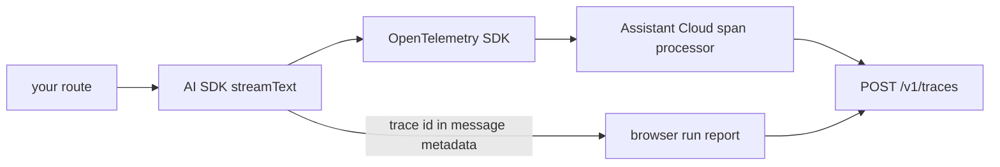

The browser sees a run from the outside: when it started, when the first token arrived, how it ended. The server sees the inside: every model call, every tool execution, the tokens each step used. Assistant Cloud joins the two. Your server exports OpenTelemetry spans to the project, the stream carries the trace id to the browser, and the browser's run report lands on the run the spans created.



## Setup with the AI SDK

<Steps>
<Step>

### Install the OpenTelemetry packages

```sh
npm i assistant-cloud @vercel/otel @ai-sdk/otel @opentelemetry/api @opentelemetry/sdk-trace-base @opentelemetry/exporter-trace-otlp-http
```

`assistant-cloud/telemetry` lists the OpenTelemetry packages as optional peers, so the main entry stays free of them.

</Step>
<Step>

### Export spans at startup

In Next.js, register the span processor in `instrumentation.ts` so it starts once per server process. The API key never leaves the server.

```ts title="instrumentation.ts"
import { registerOTel } from "@vercel/otel";
import {
  createAssistantCloudSpanProcessor,
  createAssistantCloudTraceExporter,
} from "assistant-cloud/telemetry";

export function register() {
  registerOTel({
    serviceName: "my-app",
    spanProcessors: [
      "auto",
      createAssistantCloudSpanProcessor(
        createAssistantCloudTraceExporter({
          apiKey: process.env.ASSISTANT_API_KEY!,
        }),
      ),
    ],
  });
}
```

`createAssistantCloudTraceExporter({ apiKey, baseUrl?, headers? })` posts OTLP/HTTP JSON to `POST /v1/traces` on `https://backend.assistant-api.com`; pass `baseUrl` for a self hosted cloud. `createAssistantCloudSpanProcessor(exporter, { filter? })` batches spans and, by default, forwards only GenAI spans: those with a `gen_ai.operation.name` attribute or a name starting with `gen_ai.`, `ai.` or `llm.`. Pass your own `filter` to widen or narrow that.

</Step>
<Step>

### Carry the trace id to the browser

Enable the AI SDK's OpenTelemetry integration and attach the trace id to the stream's message metadata:

```ts title="app/api/chat/route.ts"
import { OpenTelemetry } from "@ai-sdk/otel";
import { openai } from "@ai-sdk/openai";
import { convertToModelMessages, streamText } from "ai";
import { withAssistantCloudTraceMetadata } from "assistant-cloud/telemetry";

export async function POST(request: Request) {
  const { messages } = await request.json();
  const result = streamText({
    model: openai("gpt-5.6-luna"),
    messages: await convertToModelMessages(messages),
    telemetry: { integrations: [new OpenTelemetry()] },
  });

  return result.toUIMessageStreamResponse({
    messageMetadata: withAssistantCloudTraceMetadata(),
  });
}
```

`withAssistantCloudTraceMetadata(messageMetadata?)` wraps an existing metadata callback and adds `traceId` on the stream's `start` part. Use `assistantCloudTraceMetadata()` when you compose the metadata yourself. The SDK reads `traceId` from the persisted message and puts it on the run report as `trace_id`.

</Step>
</Steps>

Any OpenTelemetry setup works the same way: the exporter accepts spans from any tracer, and the browser only needs the trace id in the message metadata.

## Other producers

The receiver is a plain OTLP/HTTP endpoint, so a backend in any language fills Runs and Models without the SDK, and without a browser at all. Three things are needed:

1. Export traces to `https://backend.assistant-api.com/v1/traces` with the header `Authorization: Bearer sk_aui_proj_…`; every OpenTelemetry SDK's OTLP/HTTP exporter takes a URL and headers, and a collector can forward to it as one more exporter.
2. Spans that follow the [OpenTelemetry GenAI semantic conventions](https://opentelemetry.io/docs/specs/semconv/gen-ai/): `gen_ai.operation.name` set to `chat`, `execute_tool`, `invoke_agent` or another value from the list below, with the model, provider and token attributes. Frameworks that emit these themselves include Pydantic AI, Google ADK and Spring AI; instrumentations that use the OpenInference or OpenLLMetry attribute sets instead are not read.
3. `gen_ai.conversation.id` on the spans, set to the cloud thread id, so each run lands on its thread; `user.id` names the end user.

```yaml title="otel-collector.yaml"
exporters:
  otlphttp/assistant-cloud:
    endpoint: https://backend.assistant-api.com
    headers:
      Authorization: "Bearer ${env:ASSISTANT_API_KEY}"
```

A run that only exists as spans has no browser report to merge with; it is still listed, priced and titled like any other, and a [server side client](/docs/cloud/authorization#a-server-as-the-client) can add the thread and messages next to it.

## How spans become runs

`POST /v1/traces` is an OTLP/HTTP receiver. It accepts `application/json` and `application/x-protobuf`, plain or `gzip` and `deflate` encoded, up to 4 MB per export, with API key authentication only. It reads the GenAI semantic conventions and turns each export into runs and spans:

- A span counts when its `gen_ai.operation.name` (or the first word of its name) is `chat`, `text_completion`, `embeddings`, `execute_tool`, `invoke_agent` or `create_agent`. Any other span is rejected and counted in the response's `partialSuccess`, along with anything past 500 spans in one trace.
- A run is every GenAI span without a GenAI ancestor. An `invoke_agent` root becomes the run itself rather than a step of it.
- `execute_tool` spans become tool calls. A tool span under a model step attaches to it; a tool span with no parent attaches to the step that finished last before the tool began.
- A chat span under a tool span is that tool's sampling call, the nested model call a tool made.
- Model, provider, tokens (`gen_ai.usage.*`), finish reasons, time to first chunk and the tool call arguments and results come from the standard attributes; `gen_ai.conversation.id` links the run to the thread with that id, `user.id` or `enduser.id` names the end user, and `service.name`, `service.version` and `deployment.environment.name` become the run's service, agent and environment. Attributes the receiver does not map are kept on the span and the run.

Run ids are derived from the project, the trace and the root span id, so re exporting the same batch updates the same run instead of creating a second one.

## Merging with the browser report

A run report carrying the same W3C `trace_id` merges into the run the spans created instead of creating a second one. Server spans are authoritative for the model, provider, tokens, timings and steps; the browser report contributes `message_id`, `tags`, the `aborted` and `disconnected` outcomes, the thread and the user when the spans did not name them, and its own first token time, which lands in the run's attributes as `client.first_token_ms`. Either half can arrive first, and the merged run is titled and rolled up like any other.

The run's page draws the tree: model steps, tool calls, sampling calls, the first token marked on the time ruler, with the input, output and attributes of the selected span in a rail. Set a trace link template in Settings › Telemetry to turn the run's trace id into a link to your own trace backend.

## Sub-agent model tracking

Tools sometimes call another model, for instance a tool that delegates to a smaller or a specialised model. The cloud attributes those calls to the tool that made them, so the Models page prices them under the model that actually ran.

With trace correlation on, a chat span under a tool span is picked up automatically. Without it, collect the calls on the server and attach them to the message metadata:

```ts title="app/api/chat/route.ts"
import { convertToModelMessages, streamText, tool } from "ai";
import { openai } from "@ai-sdk/openai";
import { z } from "zod";
import {
  createSamplingCollector,
  type SamplingCallData,
} from "assistant-cloud";

export async function POST(req: Request) {
  const { messages } = await req.json();
  const samplingCalls: Record<string, SamplingCallData[]> = {};

  const result = streamText({
    model: openai("gpt-5.6-luna"),
    messages: await convertToModelMessages(messages),
    tools: {
      delegate: tool({
        inputSchema: z.object({ task: z.string() }),
        execute: async ({ task }, { toolCallId }) => {
          const collector = createSamplingCollector();
          const answer = await runSubAgent(task, {
            onSamplingCall: collector.collect,
          });
          samplingCalls[toolCallId] = collector.getCalls();
          return answer;
        },
      }),
    },
  });

  return result.toUIMessageStreamResponse({
    messageMetadata: ({ part }) => {
      if (part.type === "finish") {
        return { usage: part.totalUsage, samplingCalls };
      }
      return undefined;
    },
  });
}
```

`SamplingCallData` is `{ model_id?, input_tokens?, output_tokens?, reasoning_tokens?, cached_input_tokens?, duration_ms? }`. The SDK reads `samplingCalls` keyed by tool call id and attaches each list to the matching tool call in the report.

For MCP tools that use the sampling protocol, `wrapSamplingHandler(handler, collector.collect)` wraps the MCP client's sampling handler and records every nested `sampling/createMessage` call transparently.

## Trace links

Settings › Telemetry takes a trace link template such as `https://cloud.langfuse.com/project/abc/traces/{trace_id}`. Every run with a trace id then links to that page, so the cloud run and the full trace in your observability tool are one click apart. The [Langfuse](/docs/integrations/observability/langfuse), [LangSmith](/docs/integrations/observability/langsmith) and [Helicone](/docs/integrations/observability/helicone) pages cover the tools this pairs with.
