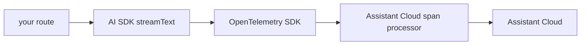

Assistant Cloud combines the browser's run report with the OpenTelemetry spans from your AI SDK route. The resulting run shows client timing beside the server-side model and tool call tree.

## How it works



The span processor exports the AI SDK spans, while the stream metadata carries the same `trace_id` to the browser report. Assistant Cloud merges both halves into one run.

## Setup

<Steps>
<Step>

### Install the OpenTelemetry packages

```sh
npm i assistant-cloud @vercel/otel @ai-sdk/otel @opentelemetry/api @opentelemetry/sdk-trace-base @opentelemetry/exporter-trace-otlp-http
```

</Step>
<Step>

### Initialize OpenTelemetry at startup

In Next.js, add the Assistant Cloud span processor in `instrumentation.ts` so it starts once per server process.

```ts title="instrumentation.ts"
import { registerOTel } from "@vercel/otel";
import {
  createAssistantCloudSpanProcessor,
  createAssistantCloudTraceExporter,
} from "assistant-cloud/telemetry";

export function register() {
  registerOTel({
    serviceName: "assistant-ui",
    spanProcessors: [
      "auto",
      createAssistantCloudSpanProcessor(
        createAssistantCloudTraceExporter({
          apiKey: process.env.ASSISTANT_API_KEY!,
        }),
      ),
    ],
  });
}
```

</Step>
<Step>

### Correlate the stream response

Enable the AI SDK OpenTelemetry integration and attach trace metadata to the UI message stream.

```ts title="app/api/chat/route.ts"
import { OpenTelemetry } from "@ai-sdk/otel";
import { openai } from "@ai-sdk/openai";
import { streamText } from "ai";
import { withAssistantCloudTraceMetadata } from "assistant-cloud/telemetry";

export async function POST(request: Request) {
  const { messages } = await request.json();
  const result = streamText({
    model: openai("gpt-5.6-luna"),
    messages,
    telemetry: { integrations: [new OpenTelemetry()] },
  });

  return result.toUIMessageStreamResponse({
    messageMetadata: withAssistantCloudTraceMetadata(),
  });
}
```

`withAssistantCloudTraceMetadata(messageMetadata?)` preserves an existing metadata callback. Use `assistantCloudTraceMetadata()` when composing the metadata yourself.

</Step>
</Steps>

## What appears in the dashboard

Each correlated run includes the server spans, tool calls, sampling calls, and first token time alongside the browser run report.

## Notes

- The API key never leaves the server.
- `createAssistantCloudTraceExporter({ apiKey, baseUrl? })` sends OTLP/HTTP JSON to `POST /v1/traces` on `https://backend.assistant-api.com` using API-key authentication only. Pass `baseUrl` when your backend host differs.

## Related

- [Assistant Cloud AI SDK integration](/docs/cloud/ai-sdk)
- [AI SDK + assistant-ui integration](/docs/cloud/ai-sdk-assistant-ui)
